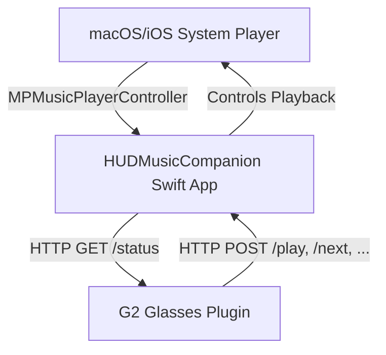

# Even Hub G2 HUD Music integration

A custom integration for Even Realities G2 smart glasses that bridges your live Apple Music playback state and album artwork directly to your HUD, with support for touchpad gesture controls.

This project consists of two components:
1. **HUD Music Plugin (`hud-music-plugin`)**: A lightweight smart glasses web app built with Vite, TypeScript, and `@evenrealities/even_hub_sdk`.
2. **HUD Music Companion (`HUDMusicCompanion`)**: A native Apple client (macOS/iOS) that reads media state from the system player and serves it via a local HTTP bridge on port `8766`.

## Features
- **Live Status Tracking**: Displays track title, artist, and album title.
- **Playback Progress**: Renders a dynamic graphical progress bar on the HUD.
- **Base64 Album Artwork**: Converts album art to optimized 4-bit color images for display on G2 glasses. Falls back to a default music icon if artwork is unavailable.
- **Touchpad Interactions**:
  - **Single Tap (Click)**: Toggle Play / Pause.
  - **Swipe Up / Forward**: Skip to next track.
  - **Swipe Down / Backward**: Skip to previous track.
  - **Double Tap**: Cleanly exit the plugin.

---

## Architecture Overview



---

## Getting Started

### 1. Run the Companion App (`HUDMusicCompanion`)
The companion app bridges the macOS/iOS system player to the glasses.

- Open `HUDMusicCompanion/HUDMusicCompanion.xcodeproj` in Xcode.
- Build and run the app on your Mac, iPad, or iPhone.
- Grant **Media & Apple Music** permissions when prompted.
- The companion app starts a local server listening on port `8766`. Note down the IP address shown in the app.

### 2. Run the Glasses Plugin (`hud-music-plugin`)
The plugin renders the HUD interface.

#### Prerequisites
Ensure you have Node.js (v20+ or v22+) installed.

#### Run in Dev Server
```bash
cd hud-music-plugin
npm install
npm run dev
```

#### Run in the Even Simulator
```bash
# Starts the official G2 simulator loading the plugin
npx @evenrealities/evenhub-simulator http://localhost:5173
```

#### Configure Connection
1. In the companion app running on your phone/mac, locate the local IP.
2. In the plugin configuration interface (on port 5173 or in the simulator settings), enter the **Companion IP** and port **8766**, then click **Save & Reconnect**.

---

## Directory Structure
- `HUDMusicCompanion/`: SwiftUI companion application source files.
- `hud-music-plugin/`: Glasses app layout, asset rendering, and event handlers.
  - `src/main.ts`: Event routing, startup page container setup, and gesture handling.
  - `src/bridge.ts`: HTTP polling and endpoint dispatch logic.
  - `src/display.ts`: Typography wrapping, progress bar generation, and canvas operations.
